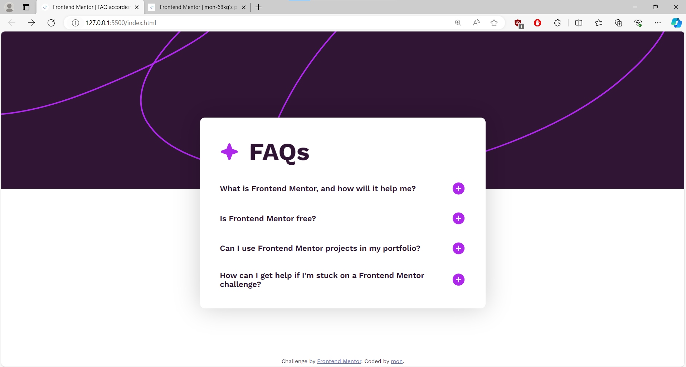
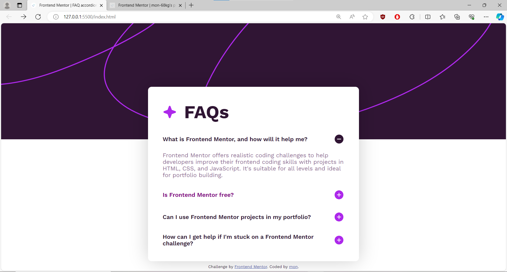

# Frontend Mentor - FAQ accordion solution

This is a solution to the [FAQ accordion challenge on Frontend Mentor](https://www.frontendmentor.io/challenges/faq-accordion-wyfFdeBwBz). Frontend Mentor challenges help you improve your coding skills by building realistic projects. 

## Table of contents

- [Overview](#overview)
  - [The challenge](#the-challenge)
  - [Screenshot](#screenshot)
  - [Links](#links)
- [My process](#my-process)
  - [Built with](#built-with)
  - [What I learned](#what-i-learned)
  - [Continued development](#continued-development)
  - [Useful resources](#useful-resources)
- [Author](#author)
- [Acknowledgments](#acknowledgments)

## Overview

### The challenge

Users should be able to:

- Hide/Show the answer to a question when the question is clicked
- Navigate the questions and hide/show answers using keyboard navigation alone
- View the optimal layout for the interface depending on their device's screen size
- See hover and focus states for all interactive elements on the page

### Screenshot





### Links

- Solution URL: [Add solution URL here](https://your-solution-url.com)
- Live Site URL: [Add live site URL here](https://your-live-site-url.com)

## My process

### Built with

- Semantic HTML5 markup
- CSS custom properties
- Flexbox
- CSS Grid

### What I learned

I learned how to add transition to an element with its height is automatically adjust depending on its content.
I also learned more about CSS Grid and media queries.
I also learned to resize svg images in CSS.

```html
<h1>Some HTML code I'm proud of</h1>
```
```css
.hide-answer {
    overflow: hidden;
    display: grid;
    grid-template-rows: 0fr;
}
.pp {
    color: hsl(292, 16%, 49%);
    font-size: 16px;
    overflow: hidden;
    grid-row: 1 / span 2;
}
.show-answer {
    overflow: hidden;
    display: grid;
    grid-template-rows: 1fr;
    padding-top: 20px;
}
```

### Continued development

I want to continue learning about CSS Grid and JavaScript Events and how to handle them.

### Useful resources

- [W3Schools](https://www.w3schools.com) - This helped me to remember things that I forgot and helped to learn things that I still don't know during the development of this challenge.
- [StackOverFlow](https://stackoverflow.com) - This helped me learned new and more effective solutions to the problems I encountered in developing this challenge.

## Author

- GitHub - [mon-68kg](https://github.com/mon-68kg)
- Frontend Mentor - [@mon-68kg](https://www.frontendmentor.io/profile/mon-68kg)

## Acknowledgments

I want to thank again all the people that create and share knowledges and tutorial online for free. Maybe one day I will create and share a tutorial too when I become a professional.